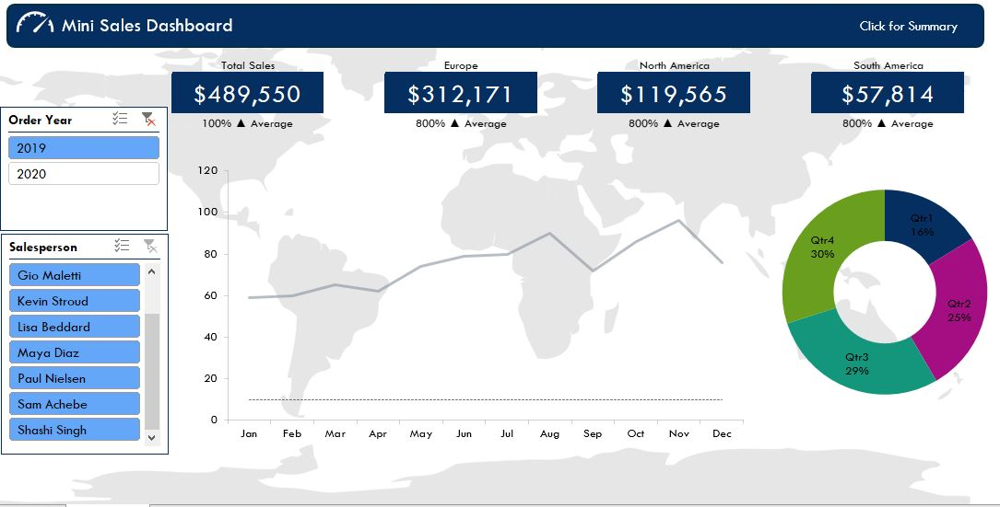
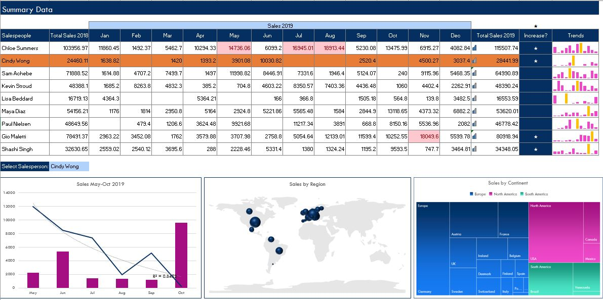

# Objective
Objecttive is to create a dashboard to effectively monitor the performances of different sales persons of a company. The Dashboard is made in MS-Excel and the data was provided in the Excel workbook file.

# Data  
Data contained information about the demographics of customers and the sales persons and the details of orders handaled by different salespersons. I have analyzed the performance of the salespersons in a particular time frame and same can be visualized by the dashboard for different time frames.

# Achievement
Dashboard is created which gives information not only about the salespersons but also about the orders.
* Order Year can be selected to get only information about the orders
* Information can be gathered about the region in which the order was placed
* For different sales persons the above metrices can also be integrated 
* The performance of sales persons can be seen on a line char for different months and on a piew chat for different years of the year

# Summaries 
* For more summary there is a link on the dashboard that takes us to the secondary dashboard that gives additional informations about the orders and can be sorted on the basis of salespersons

# Dashboard
The Dashboard looks like this

The summary page looks like this

